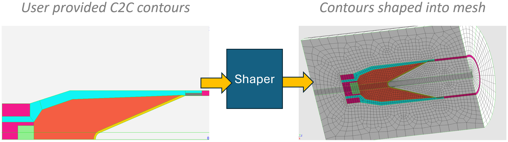
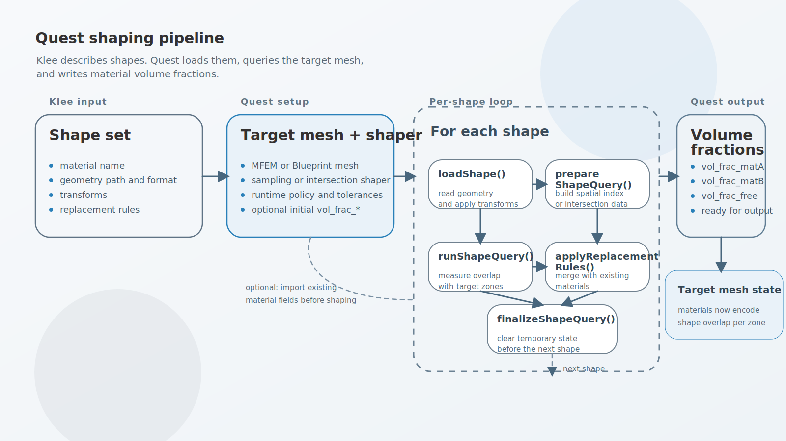
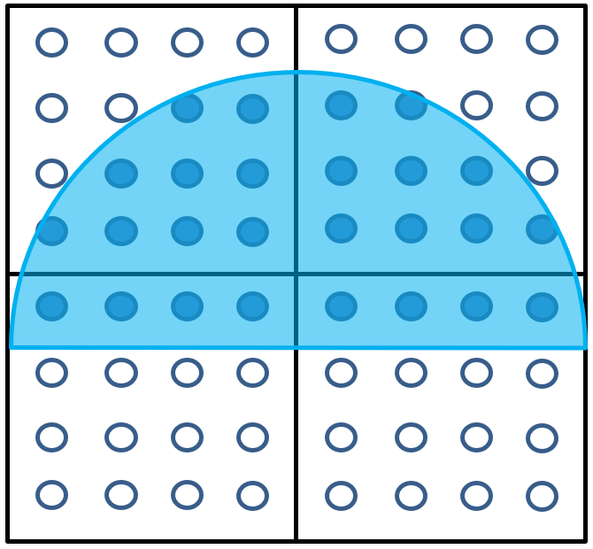
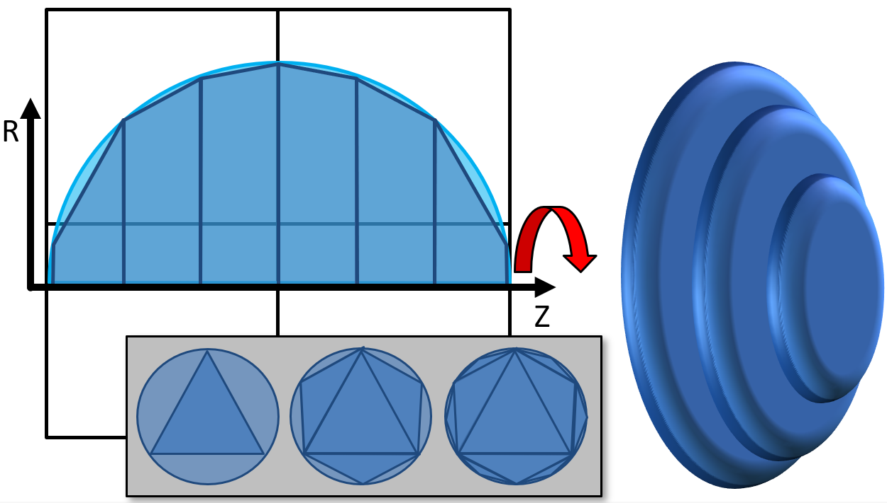

.. ## Copyright (c) 2017-2024, Lawrence Livermore National Security, LLC and
.. ## other Axom Project Developers. See the top-level LICENSE file for details.
.. ##
.. ## SPDX-License-Identifier: (BSD-3-Clause)

.. _shaping-overview:

Shaping Overview
================

Shaping is the process of overlaying additional detail into a mesh by converting
shape geometry into materials described as volume fractions within each mesh zone.
Shaping is used when it is not feasible or practical to directly build features
into the mesh itself.

   Shaping permits details to be added into meshes.

Axom's Klee component describes the models used for shaping. A Klee shape set
contains the shape geometry reference, its material name, replacement rules, and
any transforms that should be applied before shaping. Quest provides the
algorithms that read those shapes, compare them against a target mesh, and
generate the material volume fractions.

Quest provides two shaping implementations:

* ``SamplingShaper`` estimates overlap by sampling points in each target zone
  and evaluating in/out tests against the shape.
* ``IntersectionShaper`` computes overlap geometrically by intersecting the
  target mesh with discretized shape geometry.

Both shapers share the same high-level pipeline and both write volume fractions
as fields named ``vol_frac_<material>`` on the target mesh.

For MFEM-based shaping workflows, those material fields are typically
``mfem::GridFunction`` objects registered in the target
``MFEMSidreDataCollection``. The caller chooses the output field order. In the
sampling workflow, that order is set explicitly with
``SamplingShaper::setVolumeFractionOrder()``; in the example driver, it is
controlled by the selected output order. For Blueprint-based shaping workflows,
the same material information is written as fields on the Blueprint mesh.

.. _shaping-pipeline:

Shaping Pipeline
=================

Shaping involves creating a target mesh and data collection, reading a shape
set, creating a shaper, and then iterating over the shapes in the set. For each
shape, the shaper loads the geometry, prepares a spatial query structure, runs
the query against the target mesh, applies replacement rules, and cleans up any
temporary state before moving to the next shape.

   Quest shaping pipeline from Klee shape descriptions to material volume fraction fields.

First, we include relevant Axom headers:

.. code-block:: c++

  #include <axom/klee.hpp>
  #include <axom/quest.hpp>
  #include <axom/sidre.hpp>
  #include <axom/slic.hpp>

  using quest = axom::quest;
  using klee = axom::klee;
  using slic = axom::slic;
  using sidre = axom::sidre;

Quest shaping APIs operate on either:

* MFEM meshes stored in ``sidre::MFEMSidreDataCollection`` objects
* Blueprint meshes stored in a ``sidre::Group`` or ``conduit::Node``

The example below uses an MFEM mesh and an ``MFEMSidreDataCollection`` to store
the volume fraction fields.

More information on MFEM is covered at the `MFEM examples page <https://mfem.org/features/#extensive-examples>`_.

The MFEM mesh also needs an associated data collection, ``shapingDC``, to
contain the grid functions. Axom provides ``MFEMSidreDataCollection``, a
derived class of MFEM's ``DataCollection`` that interoperates with Sidre.

.. literalinclude:: ../../examples/shaping_driver.cpp
   :start-after: _load_mesh_start
   :end-before: _load_mesh_end
   :language: C++

Next, create the desired shaper and configure its parameters. Some settings live
in the common ``Shaper`` base class and apply to both shaping methods. Examples
include the runtime policy, the linearization density for curved geometry, the
vertex welding threshold for surface meshes, verbosity, and the controls for
dynamic refinement based on a percent error target.

The shaper will operate on shapes from a Klee shape set:

.. code-block:: c++

  auto shapeSet = klee::readShapeSet("/path/to/klee/file");

The shaper can also be pre-initialized with volume fractions supplied by the
calling code. This is optional, but it is useful when a simulation mesh already
contains background or previously shaped materials. Volume fraction fields use
the ``vol_frac_`` prefix followed by the material name.

.. literalinclude:: ../../examples/shaping_driver.cpp
   :start-after: _import_volume_fractions_start
   :end-before: _import_volume_fractions_end
   :language: C++

After the target mesh, shaper, and shape set are ready, the shaping pipeline is
the same for both ``SamplingShaper`` and ``IntersectionShaper``. Each shape is:

#. loaded from its geometry file
#. prepared for querying
#. queried against the target mesh
#. applied through its replacement rules
#. finalized so the shaper is ready for the next shape

.. literalinclude:: ../../examples/shaping_driver.cpp
   :start-after: _shaping_pipeline_begin
   :end-before: _shaping_pipeline_end
   :language: C++

After all shapes have been processed, the shaper adjusts the accumulated volume
fractions so the material fields on the target mesh are ready for output. For
MFEM targets, the result is usually a set of ``vol_frac_<material>``
``mfem::GridFunction`` fields, one per material, that can be saved with the
data collection or used directly by downstream code.

.. _sampling-shaper:

Sampling Shaper
---------------

``SamplingShaper`` creates volume fractions by sampling points inside each
target zone and determining whether those points are inside the shape. The
sampled results are then converted into zone-centered or higher-order volume
fraction fields.

On MFEM target meshes, these outputs are material-specific
``mfem::GridFunction`` objects. The field order is chosen by the caller, so the
result can be piecewise constant or higher order depending on the needs of the
simulation or analysis workflow.

``SamplingShaper`` supports:

* 2D and 3D target meshes
* STL and Pro/E geometry loaded as discrete surfaces
* contour-based workflows, including MFEM contours and revolved shaping through
  point projection
* higher-order output volume fraction fields
* CPU execution, with additional runtime-policy-dependent samplers for some
  3D primitive workflows

   Sampling shaper tests whether points in a zone are in/out for a shape.

Sampler selection
^^^^^^^^^^^^^^^^^

``SamplingShaper`` uses one of three internal sampler types to answer the
point-vs-shape queries that drive the volume fraction calculation. The sampler
is currently chosen primarily from the shape representation that Quest is
working with and, in one case, from the user-selected sampling method. The
examples below describe the current implementation without implying that the
samplers are inherently tied to specific readers.

``InOutSampler``
""""""""""""""""

The in/out sampler uses Quest's spatial-index-based containment queries on
discrete geometry. It is the default sampler for shapes that Quest has turned
into discrete curves or surfaces. In the current implementation, this includes:

* 2D contour geometry loaded from C2C files
* MFEM contour geometry when ``SamplingMethod::InOut`` is selected
* 3D surface geometry loaded from STL files

In practice, choose the in/out sampler when the shape is being queried through
discrete line or surface geometry and the standard containment query is
appropriate. In the example driver, this is the behavior selected by
``samplingShaper->setSamplingMethod(quest::SamplingShaper::SamplingMethod::InOut);``
or by leaving the method at its default.

``PrimitiveSampler``
""""""""""""""""""""

The primitive sampler operates directly on primitive volumetric elements rather
than a surface-based in/out query. In the current implementation, this path is
used when Quest is sampling tetrahedral shape geometry, with a backend chosen
from the active runtime policy.

Use this path when the shape geometry is already volumetric and Quest can avoid
going through a surface containment query. This is also the sampler family that
maps naturally onto the supported CPU and GPU execution policies for these
primitive-based cases.

``WindingNumberSampler``
""""""""""""""""""""""""

The winding-number sampler evaluates winding numbers on a curved contour
representation instead of using the standard in/out spatial index. In the
current implementation, this option is available for MFEM contour geometry.

Select it explicitly with
``samplingShaper->setSamplingMethod(quest::SamplingShaper::SamplingMethod::WindingNumber);``.
Quest will use it when the shape format is MFEM and the sampling method is set
to ``WindingNumber``.

This sampler is useful when the curved MFEM representation itself is the
important source of truth and you want the containment query to operate on that
curve-based model. It is currently a CPU-oriented path.

For the broader direct, linearized, and fast approximate generalized
winding-number workflows, see :doc:`Winding Numbers <winding_number>`.

Curve-based workflows that need a discrete segment representation can use
:doc:`Linearize Curves <linearize_curves>` to convert NURBS contours into a
polyline mesh before sampling or winding-number evaluation.

Summary
"""""""

In short:

* choose ``InOut`` for the standard default behavior on shapes queried through
  discrete curves or surfaces
* choose ``WindingNumber`` when curved contour geometry should be queried
  through winding numbers rather than the standard in/out path
* expect ``PrimitiveSampler`` to be chosen automatically when Quest is sampling
  supported volumetric primitive geometry

Accuracy
^^^^^^^^

The main accuracy controls are:

* ``setSamplesPerKnotSpan()`` controls how finely curved input geometry is
  linearized before sampling.
* ``setQuadratureOrder()`` controls how many sample points are used in each
  target zone.
* ``setVolumeFractionOrder()`` controls the polynomial order of the output
  volume fraction field.

For curved inputs, increasing the number of samples per knot span improves the
geometric approximation of the shape. Increasing the quadrature order improves
the overlap estimate within each target zone.

.. code-block:: c++

  shaper->setSamplesPerKnotSpan(25);
  shaper->setQuadratureOrder(5);
  shaper->setVolumeFractionOrder(2);

Point Projection
^^^^^^^^^^^^^^^^

``SamplingShaper`` can use point projectors to map points from the target mesh
into the coordinate system used by the shape query. One common use case is
projecting 3D mesh points into a 2D RZ space so that a 2D contour can define a
revolved 3D shape.

.. literalinclude:: ../../examples/shaping_driver.cpp
   :start-after: _point_projection_obj_begin
   :end-before: _point_projection_obj_end
   :language: C++

.. literalinclude:: ../../examples/shaping_driver.cpp
   :start-after: _point_projection_begin
   :end-before: _point_projection_end
   :language: C++

.. _intersection-shaper:

Intersection Shaper
--------------------

``IntersectionShaper`` computes overlap geometrically instead of sampling. It
discretizes the shape into intersection-friendly primitives and intersects those
primitives with the target mesh zones to compute volume fractions.

Depending on the input, the generated intersection geometry differs:

* 2D C2C contours can be refined into segments and intersected against 2D meshes.
* 3D shaping from 2D contours revolves the refined contour into truncated-cone
  geometry that is approximated using octahedra.
* Pro/E tetrahedral meshes and analytical 3D shapes are converted into
  tetrahedral intersection geometry.
* STL input can be used for 2D triangle-based workflows and other discrete
  surface cases handled by the implementation.

``IntersectionShaper`` supports 3D workflows on CPUs and supported GPU
backends, and it can operate on MFEM or Blueprint target meshes.

   Intersection shaper creates revolved geometry for a shape and determines volume intersection with target mesh zones.

Accuracy
^^^^^^^^^

The main accuracy controls for ``IntersectionShaper`` are the refinement level
and the optional percent-error target. The refinement level controls how finely
the internal intersection geometry is subdivided. When a percent error is
provided, Quest can switch to dynamic refinement and keep refining until the
estimated volume error falls below the requested tolerance.

.. code-block:: c++

    shaper->setPercentError(0.02);
    shaper->setRefinementType(quest::Shaper::RefinementDynamic);

Materials and replacement rules
-------------------------------

Both shapers write their results as material volume fractions on the target
mesh. ``IntersectionShaper`` also maintains a free-material field, named
``free`` by default, to represent any volume that has not yet been claimed by a
user-defined material. This field is especially useful when shapes overwrite
existing materials through replacement rules.

Quest applies replacement rules from the Klee shape description when it merges
each shape's volume fractions into the existing material state. For more on the
``replaces`` and ``does_not_replace`` properties, see Klee's
:ref:`Overlay Rules <klee-overlay-rules>` documentation.
