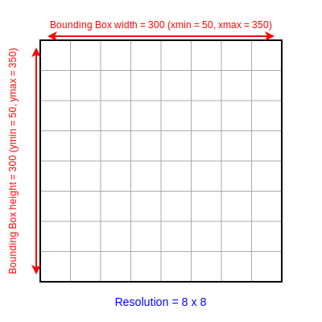

# Setting up a 2D Cartesian Mesh with Axom Sidre and Inlet

## Introduction

This tutorial introduces how to use Axom's Sidre and Inlet components to set up and manage metadata for a simple 2D Cartesian mesh. Sidre provides an efficient way to store hierarchical mesh metadata, while Inlet facilitates flexible metadata input through parameter parsing. We will focus on defining the spatial bounding box and resolution of the mesh, closely following the specifications in the [Conduit mesh blueprint](https://llnl-conduit.readthedocs.io/en/latest/mesh.html).

A basic understanding of mesh concepts and the Conduit mesh blueprint is helpful for this tutorial.

Mesh metadata defines key properties that describe the geometry and discretization of a mesh. For Cartesian meshes, two main pieces of metadata are essential:

- **Bounding Box:** Defines the spatial extent of the mesh, described by minimum and maximum coordinates in each dimension.
- **Resolution:** Specifies the number of discretization points or cells along each dimension, dictating the mesh granularity.

<figure style="text-align: center;">
  
  <figcaption>Figure: This shows the resolution and bounding box for a 2D Cartesian mesh.</figcaption>
</figure>

In this tutorial, we will demonstrate how to represent these metadata elements using Sidre data structures and configure their input with Inlet.

## Sidre Basics

Sidre is an Axom component designed for managing hierarchical data structures stored in memory efficiently. It is well-suited for storing and organizing mesh metadata and simulation data. Sidre's core concept revolves around a hierarchical tree of data containers managed by a central `DataStore`.

### Key Concepts in Sidre

- **DataStore:** The top-level container that owns the entire hierarchical data structure. All groups and views ultimately belong to a DataStore instance.

- **Groups:** Nodes in the hierarchy that act like directories or folders. Groups can contain other groups or views, helping to organize data logically.

- **Views:** Leaf nodes containing metadata or raw data. Views provide access to actual data buffers.

- **Buffers:** Memory blocks allocated to hold the data referenced by views. Views use buffers to read and write actual data values.

- **Attributes:** Metadata about the views or groups, such as type information or external identifiers, which provide additional context.

Sidre allows flexible and efficient memory management, making it ideal to store structured mesh metadata such as bounding box coordinates and resolution parameters in an accessible and modifiable way.

In the following sections, we will create groups and views within a Sidre DataStore to store the bounding box and resolution data for a Cartesian mesh.

