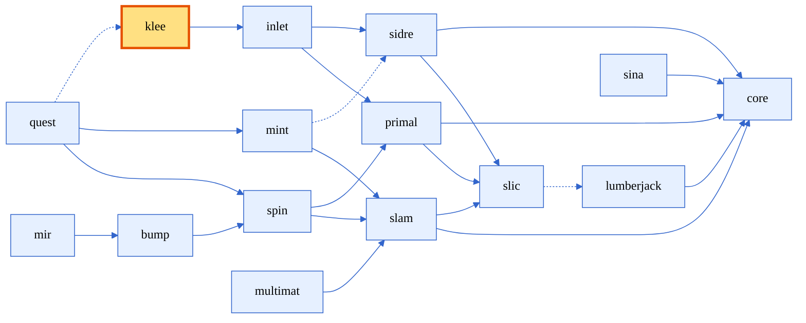
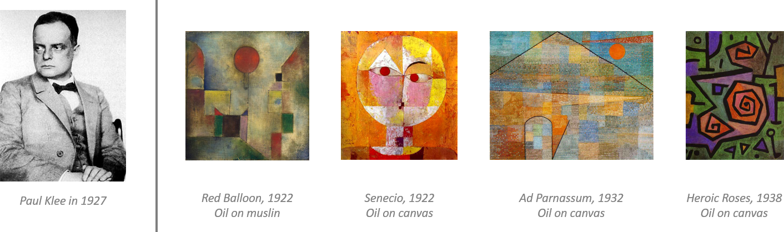
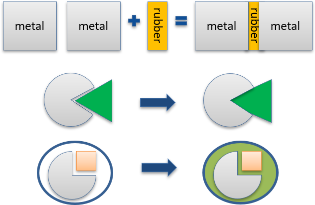
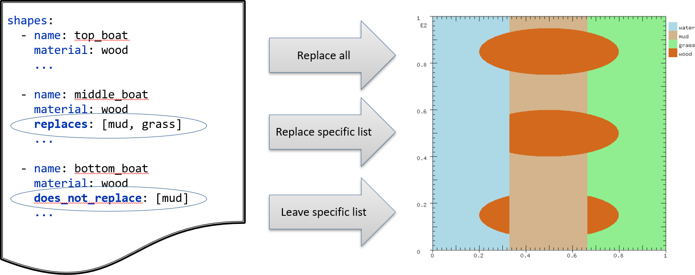
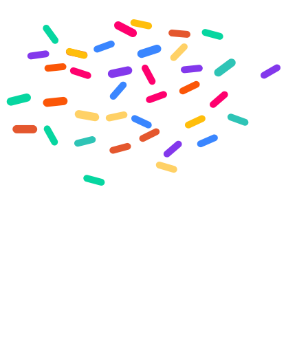

# Lesson 03: Defining Geometry Setup with Klee

In this lesson, we will use Axom's Klee component to define the geometric setup for a multimaterial simulation. 

Klee is built on top of Inlet to define the schema for geometry setup. A Klee input consists of a list of shapes; each shape specifies its material and geometry, and may optionally include *replacement rules* that describe which previously "shaped in" materials the current shape will replace or preserve.

## Introduction to Klee

<div style="text-align: center;">


<figurecaption>Figure: Axom components, highlighting Klee</figurecaption>
</div>

Klee provides a flexible framework for defining complex geometric configurations through its key components:

**ShapeSet**
: The top-level container that holds all shapes. It manages:
   - The global dimensionality for shapes (2D or 3D); individual shapes may override it if needed.
   - The ordered collection of shapes

**Shape**
: Represents a single geometric entity with an assigned material. Each shape includes:
   - A unique name identifier
   - A material designation
   - A geometry definition
   - Replacement rules (how it interacts with previously defined materials)

**Geometry**
: Defines the geometry of a shape, often a path to a file, as well as operators defining transformations that can be applied to the shape, e.g. scaling, rotating, unit conversions.

Shapes are processed in order, with later shapes potentially replacing or preserving materials from earlier shapes according to the replacement rules. This approach allows for building complex material layouts through a combination of simple shapes and clearly defined interaction rules.

> :information_source: **Why "Klee"?**
> The Klee component was named after the Swiss-German artist Paul Klee (1879-1940), who was known for his distinctive style featuring geometric shapes, abstract forms, and colorful compositions. The pronunciation of Klee (/kleɪ/, pronounced “clay”) also evokes the concept of modeling and shaping materials.
>
> <div align="center">
>   
>   <figcaption>Figure: Examples of Paul Klee's paintings featuring geometric shapes and patterns. <br />
>               Public domain images from: https://en.wikipedia.org/wiki/Paul_Klee
>   </figcaption>
> </div>


### Separation of geometric data and replacement rules
Separating the Klee input from the geometric files creates a clear division between the "business logic" of shape ordering and replacement rules and the actual geometric descriptions of shapes.

This separation provides several key benefits:
  - Geometric shapes can be reused across different simulations with different material assignments
  - Material replacement logic and geometric definitions can evolve independently
  - Simulation setup can be quickly iterated by changing replacement rules without modifying complex geometry files
  - Domain experts can focus on creating accurate geometries while simulation scientists define how materials interact
  - Version control becomes more manageable with separate geometry files and material assignment rules

<div style="text-align: center;">
  <p>
    
    
    
    
  </p>
  <figcaption>Figure: Different design iterations of a "jack" shape that could be used in Klee geometry definitions. These changes can be applied without changing the Klee input file.</figcaption>
</div>


### Geometry Definition: File formats
- Klee currently supports the following input mesh formats: 
    - `.stl` triangle mesh
    - `.c2c` contour file
    - `.mfem` contours
    - `.proe` tetrahedral meshes

> :warning: **Note:** Support for `.c2c` files is only available on LLNL's LC systems. For other environments, please use alternative geometry file formats.

> :information_source: Axom provides a Python script to convert SVG files to the MFEM format, making it easy to use vector graphics as geometry inputs for Klee.

<details>
  <summary>STL Format Example (four triangles bounding a tetrahedron)</summary>

<div style="text-align: center;">

  | STL Code (with line numbers) | Rendered Model |
  | ---------------------------- | -------------- |
  | [View full file ↗](https://github.com/LLNL/axom_data/blob/main/quest/tetrahedron.stl?short_path=21f5eaf) | [Open interactive 3D viewer on GitHub ↗](https://github.com/LLNL/axom_data/blob/main/quest/tetrahedron.stl) |

</div>
</details>

### Geometry Definition: Operators

The geometry definition can also include `operators` defining affine transformations (scaling, rotations, translations, ...) and unit conversions.

<div style="text-align: center;">
<table style="border-collapse: collapse; border: none;">
  <tr style="border: none;">
    <td style="width:40%; border: none;">

```yaml
dimensions: 2

shapes:
  - name: outer_shell
    material: steel
    geometry:
      format: c2c
      path: ../contours/unit_circle.contour
      units: cm
      operators:
        - scale: 5
  - name: inner_ball
    material: void
    geometry:
      format: c2c
      path: ../contours/unit_circle.contour
      start_units: mm
      end_units: cm
      operators:
        - scale: 25
        - convert_units_to: cm
```

  </td>
  <td style="width:40%; border: none;">

```yaml
dimensions: 2

shapes:
  - name: front_left_wheel
    material: steel
    geometry:
      format: stl
      path: wheel.stl
      units: cm
      operators:
        - rotate: 90
        - translate: [100, -80, 0]
  - name: front_right_wheel
    material: steel
    geometry:
      format: stl
      path: wheel.stl
      units: cm
      operators:
        - rotate: -90
        - translate: [100, 80, 0]
```

  </td>
  </tr>
</table>
  <figcaption>Figure: Example Klee inputs showing `scale`, `translate`, `rotate` and unit conversion operators.</figcaption>
</div>


### Replacement Rules
Replacement rules give users some extra control in how shapes get overlaid. By default, a new shape of a given material will replace all other shapes.

<div style="text-align: center;">
  
  <figcaption>Figure: Replacement rules have many uses, including when there are overlapping parts (top), when we need to expand a shape to close a gap (middle), or when we need to fill a void (bottom).</figcaption>
</div>

If desired, users can either add an explicit list of materials to replace via the `replaces` entry, or an explicit list of materials to preserve via the `does_not_replace` entry (but not both).

<div style="text-align: center;">
  
  <figcaption>Figure: Illustration of Klee replacement rules (default, explicit "replaces" list, and explicit "does_not_replace" list) and how later shapes interact with earlier materials when shaping "wood" boats on a mesh with "water", "mud" and "grass".</figcaption>
</div>


<details>
<summary>Input Structure</summary>

- Top-level
  - dimensions: 2 | 3
  - shapes: array of shape entries
- Shape
  - name: unique string
  - material: string
  - geometry
    - format: non | stl | c2c | mfem | proe
    - path: relative path to geometry file
    - start_units/end_units/units: unit metadata
    - operators: ordered list of transforms/conversions
      - translate: [dx, dy, dz]
      - rotate: ang
        axis: [ax, ay, az]
        center: val
      - scale: scalar or [sx, sy, sz]
      - convert_units_to: target_unit
  - replaces: <list>
  - does_not_replace: <list>
</details>

## Examples: 

### Simple 2D Contours With Units and Scaling

```yaml
dimensions: 2

shapes:
  - name: outer_shell
    material: steel
    geometry:
      format: c2c
      path: ../contours/unit_circle.contour
      units: cm
      operators:
        - scale: 5
  - name: inner_ball
    material: void
    geometry:
      format: c2c
      path: ../contours/unit_circle.contour
      start_units: mm
      end_units: cm
      operators:
        - scale: 25
        - convert_units_to: cm
```

<details>
<summary> Another example w/ STL meshes </summary>

```yaml
dimensions: 3
units: m
shapes:
  - name: fluid_volume
    material: water
    geometry:
      format: stl
      path: ../meshes/volume.stl
      operators:
        - scale: 0.1
  - name: rotor_blade
    material: composite
    geometry:
      format: stl
      path: ../cad/blade.stl
      operators:
        - rotate:
            axis: [0, 1, 0]
            angle: 30
        - translate: [2.0, 0.0, 0.0]
```
</details>

## Let's see some code!

The code example for this lesson loads an Klee file, performs some validation and then prints out details about the geometric setup

### Load and validate the Klee input

```cpp
try
{
  auto shapeSet = axom::klee::readShapeSet(inputFilename);
}
catch(axom::klee::KleeError& error)
{
  std::vector<std::string> errs;
  for(auto verificationError : error.getErrors())
  {
    errs.push_back(axom::fmt::format(" - '{}': {}",
                                      static_cast<std::string>(verificationError.path),
                                      verificationError.message));
  }

  SLIC_WARNING(
    axom::fmt::format("Error during parsing klee input. Found the following errors:\n{}",
                      axom::fmt::join(errs, "\n")));
}
```

Next, we loop through the shapes and print out information about each shape. We're using an fmt memory_buffer (similar to a stringstream) to write everything in a single log statement:
```cpp
  axom::fmt::memory_buffer buffer;
  axom::fmt::format_to(std::back_inserter(buffer), "Klee ShapeSet Information:\n");

  axom::fmt::format_to(std::back_inserter(buffer),
                       "  Overall dimensions: {}\n",
                       dimensionsToString(shapeSet.getDimensions()));

  // Step 1: Collect and print sorted list of material names
  std::vector<std::string> materials = [&shapeSet]() {
    std::set<std::string> materialSet;
    for(const auto& shape : shapeSet.getShapes())         // <-- 1(a)
    {
      materialSet.insert(shape.getMaterial());            // <-- 1(b)
    }
    return std::vector<std::string>(materialSet.begin(), materialSet.end());
  }();
  axom::fmt::format_to(std::back_inserter(buffer),
                       "\n  Unique materials ({}): {}\n",
                       materials.size(),
                       materials);

  // Step 2: Print information about each shape
  fmt::format_to(std::back_inserter(buffer),
                 "\n  Details for the {} shapes:\n",
                 shapeSet.getShapes().size());
  for(const auto& shape : shapeSet.getShapes())
  {
    const auto& geom = shape.getGeometry();               // <-- 2(a)

    axom::fmt::format_to(
      std::back_inserter(buffer),
      "  - name: '{}'\n"
      "    material: '{}'\n"
      "    format: '{}'\n"
      "    units: {}\n"
      "    dimensions: {}\n"
      "    replaces materials: {}\n\n",
      shape.getName(),                                   // <-- 2(b)
      shape.getMaterial(),
      geom.getFormat(),
      formattedUnits(geom.getStartProperties().units, geom.getEndProperties().units),
      formattedDimensions(geom.getInputDimensions(), geom.getOutputDimensions()),
      getMaterialsReplacedBy(shape, materials));
  }

  SLIC_INFO(axom::fmt::to_string(buffer));
```

## Challenge

Let's create a setup for an ice cream cone, which will consist of a cone, and ice cream scoop and a bunch of sprinkes.

<div style="text-align: center;">
<p>
  
  
  
  
  <figcaption>Figure: Ice cream cone geometry for the challenge.</figcaption>
</div>


- Task: convert a 2D mfem contour from inches to cm, scale by 3, rotate 45 degrees, then overwrite only air while preserving steel
- Expected input fragment:

```yaml
dimensions: 2

shapes:
  - name: background
    material: background
    geometry:
      format: none

  - name: vanilla_scoop
    material: ice_cream
    geometry:
      format: mfem
      path: ice_cream_scoop.mfem
      units: cm
      operators:
        - scale: 1.1
        - rotate: 5
        - translate: [0.0, 2.0]

  - name: colorful_sprinkles
    material: sprinkles
    geometry:
      format: mfem
      path: ice_cream_sprinkles.mfem
      units: cm
      operators:
        - rotate: 15
        - translate: [0.0, 3.0]
    replaces: [ice_cream]

  - name: cone
    material: batter
    geometry:
      format: mfem
      path: ice_cream_cone.mfem
      units: cm
      operators:
        - rotate: -5
        - translate: [0.0, -2.0]
    does_not_replace: [ice_cream, sprinkles]

```

## Summary and Next Steps

In this lesson, we learned about geometric setup through Klee. In the next lesson, we'll explore Axom's shaping algorithms, which will generate the volume fractions on a computational mesh associated with a user-provided Klee input.
